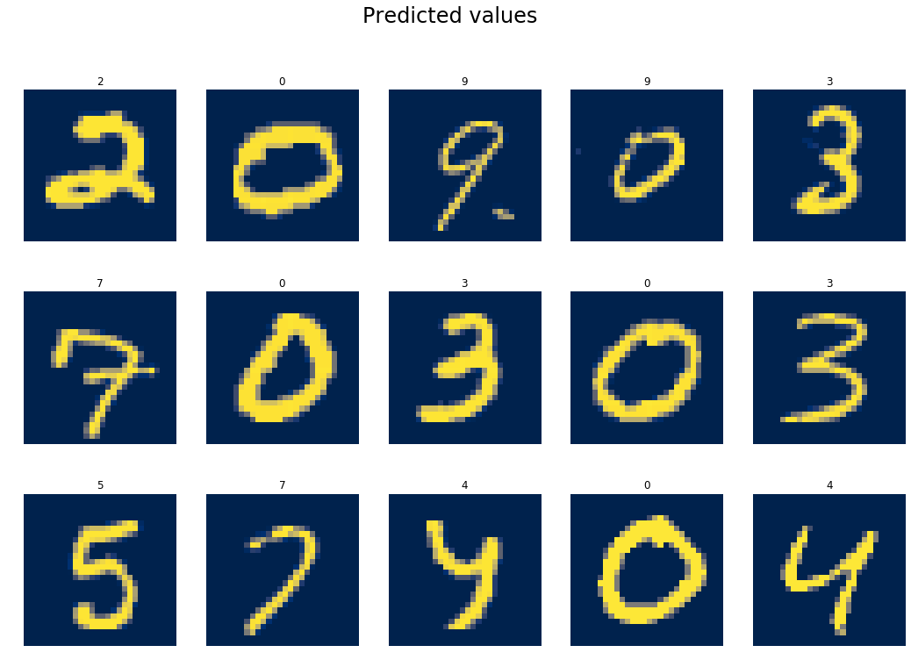
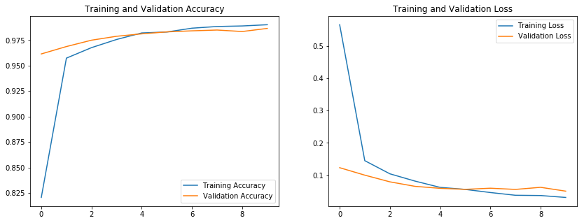
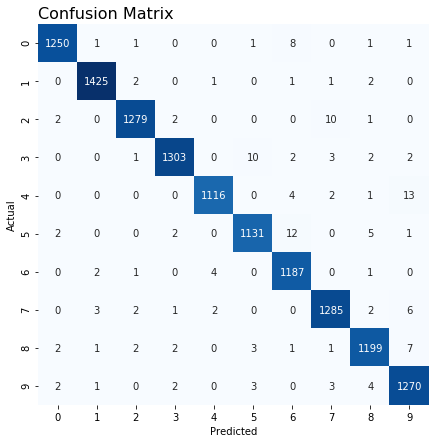
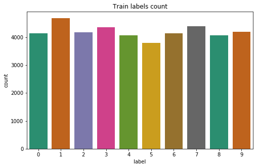

💬 Handwritten Digit Recognition using CNN 🔬

[](https://www.python.org/downloads/)
[](https://www.tensorflow.org/)
[](https://keras.io/)
[]((https://opensource.org/licenses/Aleppo)) 

This project demonstrates the classification of handwritten digits from the famous MNIST dataset using a Convolutional Neural Network (CNN).
The model is built with TensorFlow and Keras and achieves a high validation accuracy of approximately 98.7%.
The project covers the complete workflow from data loading and preprocessing to model building, training, evaluation, and prediction.

## 📋 Table of Contents

- [Overview](#overview)
- [Features](#features)
- [Project Structure](#project-structure)
- [Technology Stack](#technology-stack)
- [Exploratory Data Analysis (EDA) Insights](#exploratory-data-analysis-eda-insights)
- [Dataset](#dataset)
- [Installation](#installation)
- [Usage](#usage)
- [Contributing](#contributing)
- [License](#license)
- [Author](#author)

📝 Overview
The MNIST ("Modified National Institute of Standards and Technology") dataset is a classic in the field of computer vision, serving as a key benchmark for classification algorithms.
This project tackles the challenge of correctly identifying digits from thousands of handwritten images using a robust CNN designed to learn their intricate patterns.

**The core model utilizes:**

  - Convolutional Layers (Conv2D) to automatically and adaptively learn spatial hierarchies of features, such as edges and textures, from the input images.
  -  Max Pooling Layers (MaxPool2D) to reduce the spatial dimensions of the feature maps, which decreases computational load and helps make the feature detection robust to scale and orientation changes.
  -  Dense (Fully Connected) Layers to perform classification based on the high-level features extracted by the convolutional and pooling layers.
  -  Dropout Regularization to prevent overfitting by randomly setting a fraction of input units to 0 at each update during training, which helps the model generalize better to unseen data.
    
## 🌟 Features

-   **Handwritten Digit Classification:**: Accurately classifies 28x28 pixel grayscale images into 10 categories (digits 0 through 9).
-   **Efficient CNN Model:**:
    -   Two convolutional layers for effective hierarchical feature extraction.
    -   Two max-pooling layers for dimensionality reduction and efficiency.
    -   Dropout layers for robust regularization and prevention of overfitting.
-   **Standard Data Preprocessing:**: 
    -   **Normalization:** Pixel values are scaled to a [0, 1] range to ensure stable and efficient training.
    -   **Reshaping:** Flat pixel arrays are reshaped into 28x28x1 tensors suitable for the CNN input layer.
    -   **One-Hot Encoding:** Target labels (0-9) are converted into a categorical format required for the softmax output layer.
-   **Comprehensive Evaluation**: Model performance is thoroughly assessed using:
     - Training and validation accuracy/loss curves.
     - A detailed classification report showing precision, recall, and F1-score for each digit.
     - A confusion matrix to visualize class-specific performance.
-   **Clear Visualizations: **: the notebook includes plots for data exploration (label distribution, image samples), model performance, and prediction examples.
    
## 📈 Results

**Example Predicted Values:**



**Validation loss and accuracy**


**Confusion Matrix**



## 📂 Project Structure

```
📦 Handwritten-Digit-images-classifiction
 ┣ 📂 src                         # Main project directory
 ┃ ┗ 📜 digits-mnist-classification-using-cnn.ipynb   # Source code for the model training and testing.
 ┃ 📂 Images                       # Optional: For storing images used in README
 ┃ 📜 README.md                  # This file
 ┗ 📜 requirements.txt           # Python package dependencies
```

## 🛠️ Technology Stack

-   **Programming Language**: Python 3.8+
-   **Deep Learning Framework**: TensorFlow 2.x, Keras
-   **Data Manipulation & Analysis:**: Pandas, NumPy
-   **Data Manipulation & Analysis**: Pandas, NumPy
-   **Data Visualization:** Matplotlib, Seaborn
-   **Machine Learning Utilities:**: Scikit-learn
-   **Development Environment**: Jupyter Notebooks

## 📊 Exploratory Data Analysis (EDA) Insights

The `EDAv1.2.ipynb` notebook provides crucial insights into the dataset:
-   **Label Distribution:** A count plot of the labels confirmed that the dataset is well-balanced, with each digit (0-9) appearing a similar number of times. This is beneficial as it prevents the model from developing a bias towards more frequent classes.



## 📚 Dataset
This project uses the Digits MNIST dataset from Kaggle, which is a widely recognized benchmark for image classification tasks.
- The dataset contains 60,000 training images and 10,000 testing images of handwritten digits.
- You can download it directly from the competition page: [Digits MNIST on Kaggle](https://www.kaggle.com/code/imdevskp/digits-mnist-classification-using-cnn).

## ⚙️ Installation

1.  **Clone the Repository:**
    ```bash
    git clone https://github.com/AlharthAlhajHussein/Handwritten-Digit-images-classification.git
    cd Handwritten-Digit-images-classification
    ```

2.  **Create and Activate a Virtual Environment (Highly Recommended):**
    ```bash
    python -m venv venv
    # On Windows:
    venv\Scripts\activate
    # On macOS/Linux:
    source venv/bin/activate
    ```

3.  **Install Dependencies:**
    Ensure you are in the `Handwritten-Digit-images-classification` directory where `requirements.txt` is located.
    ```bash
    pip install -r requirements.txt
    ```


## 🚀 Usage

** Model Training and Exploration (Jupyter Notebooks):**

   -   To explore the data or retrain/experiment with the model, open and run the Jupyter Notebooks:
       -   `src/digits-mnist-classification-using-cnn.ipynb`: For the model training pipeline, experimentation with different architectures, and evaluation.

## 🤝 Contributing

Contributions, issues, and feature requests are welcome! Feel free to check the [issues page](<your-github-repo-url>/issues) if you want to contribute.

1.  Fork the Project.
2.  Create your Feature Branch (`git checkout -b feature/AmazingFeature`).
3.  Commit your Changes (`git commit -m 'Add some AmazingFeature'`).
4.  Push to the Branch (`git push origin feature/AmazingFeature`).
5.  Open a Pull Request.

## 📄 License

Distributed under the Aleppo License. See `LICENSE` for more information.

## 👨‍💻 Author

**Alharth Alhaj Hussein**

Connect with me:
-   [](https://www.linkedin.com/in/alharth-alhaj-hussein-023417241)
-   [](https://github.com/AlharthAlhajHussein)
-   [](https://www.kaggle.com/alharthalhajhussein)
-   [](https://www.youtube.com/@Alharth.Alhaj.Hussein)

---

If you find this project insightful or useful, please consider giving it a ⭐ on GitHub!
